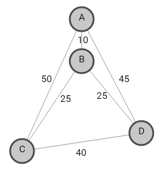

# Routing

One of the most intriguing areas of operations research is routing, in which the goal is to find efficient paths for transporting items through a complex network. The network is usually represented by a graph like the one below.

Each node represents a location, and a route is a path through a set of nodes.

Most real routing problems involve finding efficient routes for vehicles — cars, trains, airplanes, and so on — so they are often referred to as vehicle routing problems.

Routing problems can be divided into two main types — node-routing problems and arc-routing problems — depending on whether the goal is expressed in terms of visiting the nodes (locations) or the arcs (the edges connecting them). We'll give an example of each.

First, here's an arc-routing problem that Google needs to solve daily. If you have seen the Google Maps [Street View](https://www.google.com/streetview/), you may have wondered how Google obtains street-level images at millions of addresses around the world. The answer is simple: a Google team continually drives the world's roads in a fleet of vehicles equipped with cameras that automatically take pictures of each address. Google's problem is to construct the shortest route for each vehicle that traverses every street in an assigned region. If you represent this problem by a graph, in which arcs represent streets, and nodes are street intersections, the arc-routing problem is to find the shortest path that traverses every arc in the graph. Google uses the same technology provided in OR-Tools to solve this problem every day.

An example of a node-routing problem is vehicle routing. Suppose that a company needs to deliver packages to various locations, using a fleet of vehicles. In the graph for this problem, nodes represent locations, and arcs represent routes between them. Each arc has a weight, corresponding to the cost of traveling that route. The problem: find a set of paths in the graph (corresponding to delivery routes for each vehicle) that includes every destination while minimizing the total cost. This differs from the arc-routing problem because the paths don't have to traverse every arc, just include every node.

OR-Tools includes a specialized vehicle [routing library](https://developers.google.com/optimization/reference/constraint_solver/routing/) to solve many types of vehicle routing problems:

Traveling Salesman problems
- Capacitated vehicle routing problems, where the vehicles have constraints on their maximum loads
- Vehicle routing problems with time windows, where the vehicles must start or finish tasks by a certain time
- Pickup and delivery problems

The most famous of these is the Traveling Salesman Problem (TSP), described in the [next section](https://developers.google.com/optimization/routing/tsp/tsp).

We should add that there are other solvers, such as [Concorde](http://www.math.uwaterloo.ca/tsp/concorde.html), dedicated to solving very large TSPs to optimality, which surpass OR-Tools in that area. However, OR-Tools provides a better platform for solving more general routing problems that contain constraints beyond those of a pure TSP.

---

_Except as otherwise noted, the content of this page is licensed under the Creative Commons Attribution 3.0 License, and code samples are licensed under the Apache 2.0 License. For details, see our Site Policies. Java is a registered trademark of Oracle and/or its affiliates._

_Last updated May 2, 2017._
